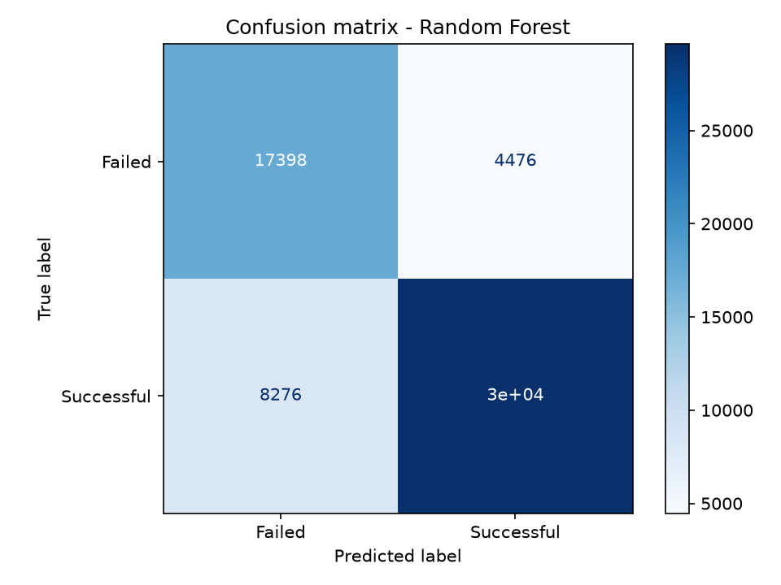
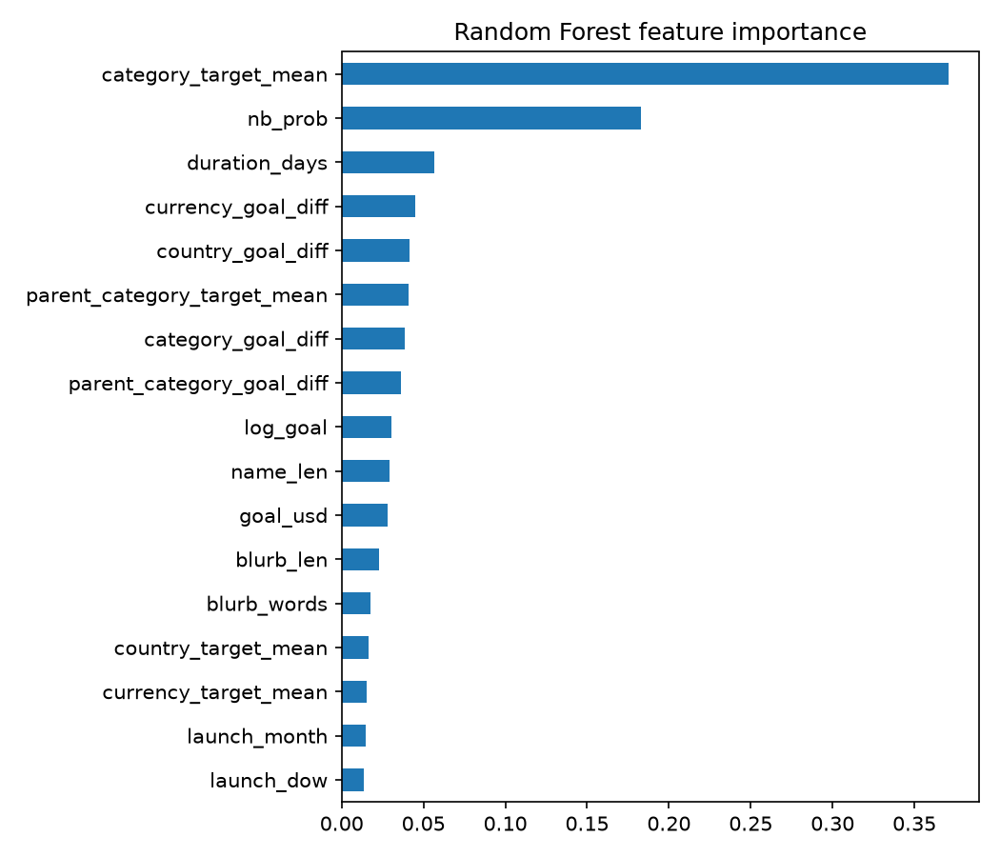

# Kickstarter Project Success Prediction

UE24CS352A Machine Learning - Mini Project

Predicts whether a Kickstarter project will reach its funding goal using only information known **at launch**
(funding goal, duration, category, country, launch date, and the project name/blurb text).
The approach follows *"Crowdfunding: Predicting Kickstarter Project Success"* (Khosla, Reinecke, Wittenbrink, Stanford).

## Team

| Mithun S | PES2UG24AM208 |
| Raksha R Poojary | PES2UG24AM214 |

## Project structure

```
src/data.py        load + clean the CSVs (Web Robots format; Kaggle format as fallback)
src/features.py    feature engineering (out-of-fold target encoding, TF-IDF + Naive Bayes text feature)
src/train.py       trains Logistic Regression, Random Forest, Gradient Boosting; saves results and plots
src/app.py         Streamlit demo app
scripts/make_sample_data.py   synthetic data, only to check that the setup works
```

## Setup

```bash
python -m venv venv
source venv/bin/activate        # Windows: venv\Scripts\activate
pip install -r requirements.txt
```

## Get the dataset

1. Open the Web Robots Kickstarter datasets page: https://webrobots.io/kickstarter-datasets/
2. Download the monthly CSV archives (the paper used April 2019 to April 2021; a few months is enough
   for a quick run), unzip them, and put all `.csv` files in `data/raw/`.

The Kaggle file `ks-projects-201801.csv` also works if placed in `data/raw/`, but it has no blurb text.

## Run

```bash
# 1. Check the setup with synthetic data (optional, results are meaningless)
python scripts/make_sample_data.py --out data/sample
python src/train.py --data-dir data/sample

# 2. Train on the real data (add --sample 60000 for a faster run)
python src/train.py --data-dir data/raw

# 3. Launch the demo
streamlit run src/app.py
```

`train.py` writes `outputs/results.csv`, `outputs/confusion_matrix.png`, `outputs/feature_importance.png`
and the best model to `models/best_model.joblib`.

## Method summary

- Keep only completed projects (successful = 1, failed = 0); remove duplicates across monthly files.
- 70/30 stratified train/test split; class weights used to balance the two outcomes.
- Features: log goal (USD), duration, name/blurb length, launch month/weekday, target-mean encodings of
  category / parent category / country / currency and the goal relative to each category's mean goal
  (all computed out-of-fold to avoid leakage), and a Naive Bayes probability from the TF-IDF of name + blurb.
- Models: Logistic Regression, Random Forest, Gradient Boosting, plus an ablation without the text feature.
- Metrics: accuracy, F1, and precision / recall for both classes.

## Results

Test set: 59,770 projects (70/30 split of 199,233 projects).

| Model | Accuracy | F1 | Precision (success) | Precision (failed) | Recall (success) | Recall (failed) |
|---|---|---|---|---|---|---|
| Random Forest | 0.787 | 0.823 | 0.869 | 0.678 | 0.782 | 0.795 |
| Gradient Boosting | 0.787 | 0.822 | 0.874 | 0.675 | 0.776 | 0.806 |
| Logistic Regression | 0.778 | 0.816 | 0.860 | 0.669 | 0.777 | 0.780 |
| Gradient Boosting (no text feature) | 0.773 | 0.809 | 0.869 | 0.655 | 0.756 | 0.802 |

Random Forest was saved as the best model and is used in the demo app.



